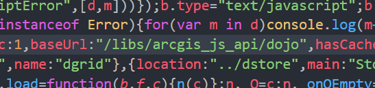

# AGS Project

## 基础环境
| 序号     | 名称     | 版本        |说明|
| :------:  |:------: | :---------:|:------:|
|1          |Node      | ^v8||
|2|AGS API |^4.5||
|3|VSCode/Atom|last|开发环境|
        

## 获取代码
```
git clone https://github.com/guzhongren/Tutorial-of-AGS_API-for-4.X-Development.git
```
## 配置AGS API

在[官网](https://developers.arcgis.com/javascript/latest/guide/get-api/index.html)下载4.X版本的API,解压后将4.X目录下的所有文件拷贝至此git项目/arcgis_js_api(需新建)目录下；按照官方文档修改init.js和dojo.js中的路径，本文修改如下,将
```
[HOSTNAME_AND_PATH_TO_JSAPI]
```
替换为
```
/arcgis_js_api/
```
结果显示如下



## 全局安装httpserver
```
npm install httpserver -g  # yarn add global httpserver
```
## 启动项目
1. 在当前目录运行如下命令
```
httpserver
```
2. 在浏览器打开命令中提示的网址,如:http://localhost:8080
